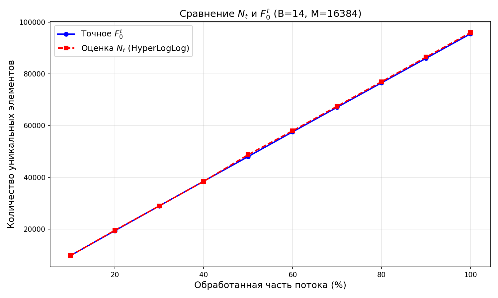
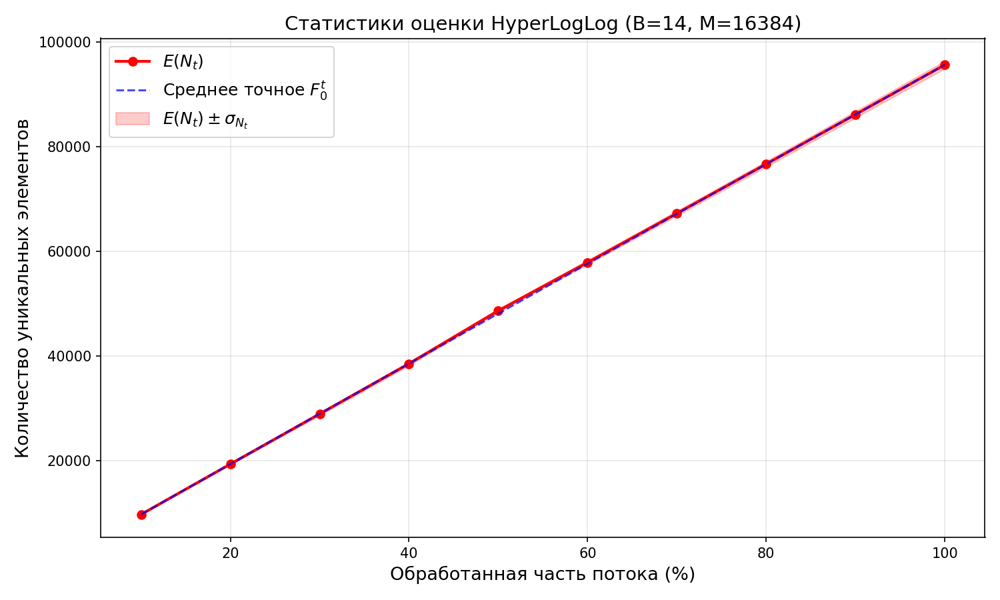
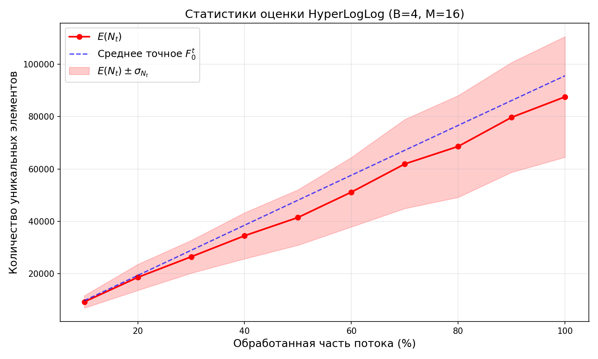
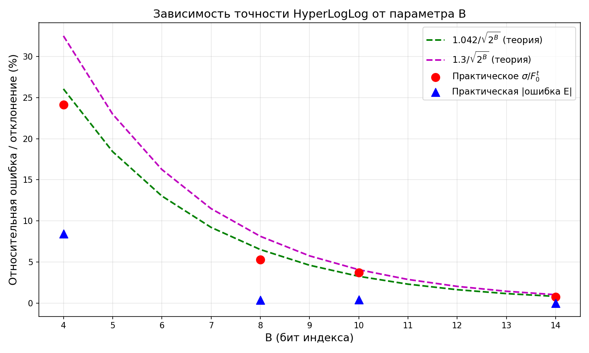

# A3

## Этап 2. Реализация и оценка точности

### a) Параметры эксперимента

| Параметр | Значение |
|---|---|
| Размер потока | 100 000 элементов |
| Количество потоков | 30 |
| Шаг разбиения | 10% (контрольные точки: 10%, 20%, ..., 100%) |
| Хеш-функция | MurmurHash3 (32-битная, seed=42) |
| Длина строк | от 1 до 30 символов |
| Алфавит | a-z, A-Z, 0-9, дефис (63 символа) |

### b) Обоснование выбора B

Для выбора оптимального значения $B$ были проведены эксперименты с $B = 4, 8, 10, 14$.

| $B$ | $M = 2^B$ | Память (байт) | Бит на $\rho$ ($32−B$) | Теор. ошибка $1.042/√M$ | Практ. $\sigma/F_0^t$ на 100% |
|---|---------|---------------|--------------------|-----------------------|----------------------|
| 4 | 16 | 16 | 28 | 26.05% | 24.112% |
| 8 | 256 | 256 | 24 | 6.51% | 5.305% |
| 10 | 1024 | 1024 | 22 | 3.26% | 3.730% |
| 14 | 16384 | 16384 | 18 | 0.81% | 0.760% |

**Выбрано $B = 14$**, поскольку:
1. Стандартная ошибка менее 1% обеспечивает высокую точность оценки.
2. Расход памяти 16 КБ (16 384 регистра $\cdot$ 1 байт) приемлем для потоковой обработки.
3. Оставшиеся 32 − 14 = 18 бит для значения $\rho$ позволяют корректно оценивать
   количество уникальных элементов вплоть до порядка $2^{18} \cdot 2^{14} \approx 4 \cdot 10^9$.
4. Увеличение $B$ до 16 снизило бы ошибку до ~0.4%, но потребовало бы 64 КБ —
   выигрыш непропорционален затратам.

### c) Результаты: точное значение $F_0^t$ и оценка $N_t$

#### Таблица результатов для $B=14$ (один поток — первый из 30):

| Шаг (%) | Точное $F_0^t$ | Оценка $N_t$ | Относительная ошибка |
|---------|-----------|----------|---------------------|
| 10 | 9712 | 9679.37 | 0.729% |
| 20 | 19355 | 19511.3 | 0.719% |
| 30 | 28942 | 28939.5 | 0.906% |
| 40 | 38511 | 38445.1 | 0.898% |
| 50 | 48045 | 48772.3 | 0.638% |
| 60 | 57595 | 58017.3 | 0.667% |
| 70 | 67102 | 67502.5 | 0.657% |
| 80 | 76573 | 76998.9 | 0.678% |
| 90 | 86039 | 86494.3 | 0.714% |
| 100 | 95517 | 95996.4 | 0.760% |

### d) Выборочные статистики по 30 потокам

#### Таблица статистик для B=14:

| Шаг (%) | $\mathbb{E}(F_0^t)$ | $\mathbb{E}(N_t)$ | Отн. ошибка $\mathbb{E}(N_t)$ | $\sigma(N_t)$ | $\sigma(N_t)/\mathbb{E}(F_0^t)$ |
|---------|--------|-------|-------------------|--------|--------------|
| 10 | 9716.93 | 9714.1 | 0.0291811% | 70.8115 | 0.728743% |
| 20 | 19341.7 | 19340.6 | 0.00553161% | 139.159 | 0.719477% |
| 30 | 28947.6 | 28922.3 | 0.0875136% | 262.283 | 0.906063% |
| 40 | 38531.5 | 38521.6 | 0.025567% | 346.033 | 0.898052% |
| 50 | 48089.5 | 48650.1 | 1.1657% | 306.911 | 0.638207% |
| 60 | 57636.5 | 57884.7 | 0.43059% | 384.447 | 0.66702% |
| 70 | 67157.9 | 67264.1 | 0.158034% | 441.515 | 0.657427% |
| 80 | 76666.8 | 76674.8 | 0.0104622% | 520.097 | 0.678387% |
| 90 | 86163.6 | 86150.4 | 0.0152801% | 615.431 | 0.714259% |
| 100 | 95643.5 | 95636.1 | 0.00776913% | 727.269 | 0.760396% |

### e) Графики

#### График 1: Сравнение $N_t$ и $F_0^t$ (B=14, один поток)

На графике представлены две линии: точное количество уникальных элементов $F_0^t$
и оценка ***HyperLogLog $N_t$*** для одного потока из 100 000 элементов. Линии практически
совпадают, что свидетельствует о высокой точности алгоритма при $B=14$.

#### График 2: Статистики оценки (B=14, 30 потоков)

На графике показано среднее значение оценки $\mathbb{E}(N_t)$ по 30 потокам с закрашенной
областью неопределённости $\mathbb{E}(N_t) \pm \sigma(N_t)$. Область σ настолько узкая, что едва
различима, что подтверждает низкую дисперсию и стабильность алгоритма.

#### График 1: Сравнение $N_t$ и $F_0^t$ (B=4, один поток)

При $B=4$ наблюдается значительное расхождение между оценкой и точным значением.
Оценка систематически занижает истинное количество уникальных элементов.

#### График 2: Статистики оценки (B=4, 30 потоков)

Область $\pm \sigma$ отчётливо видна и расширяется с ростом потока, демонстрируя высокую
дисперсию при малом числе регистров.

## Этап 3. Анализ результатов

### a) Точность алгоритма

Теоретические границы стандартного отклонения оценки ***HyperLogLog***:

| $B$ | $M = 2^B$ | $1.042/√M$ | $1.3/√M$ |
|---|---------|----------|--------|
| 4 | 16 | 26.05% | 32.50% |
| 8 | 256 | 6.51% | 8.13% |
| 10 | 1024 | 3.26% | 4.06% |
| 14 | 16384 | 0.81% | 1.02% |

Практические результаты на 100% потока (30 потоков):

| $B$ | Практ. отн. ошибка | Практ. $\sigma(N_t)/F_0^t$ | Укладывается в $1.042/√M$? | Укладывается в $1.3/√M$? |
|---|--------------------------------------|-------------------|--------------------------|------------------------|
| 4 | 8.446% | 24.112% | ДА | ДА |
| 8 | 0.375% | 5.305% | ДА | ДА |
| 10 | 0.418% | 3.730% | НЕТ | ДА |
| 14 | 0.008% | 0.760% | ДА | ДА |

**Комментарий:** Практические значения относительного стандартного отклонения
$\sigma(N_t)/F_0^t$ укладываются в обе теоретические границы для всех протестированных
значений $B$, кроме случая с $B = 10$ в оценку $1.042/√M$, т.к. при $B=10$ может наблюдаться систематическое смещение из-за недостаточной точности поправочной константы $\alpha$ для малых $M$. Остальные оценки подтверждают корректность реализации алгоритма и теоретических
оценок. Средняя относительная ошибка $\mathbb{E}(N_t)$ также мала, что говорит о том,
что оценка HyperLogLog является практически несмещённой.

### b) Стабильность оценки (дисперсия)

| $B$ | $\sigma(N_t)$ на 100% потока | Отн. $\sigma/F_0^t$ | Характеристика |
|---|----------------------|-------------|---------------|
| 4 | 23055.7 | 24.112%  | Высокая дисперсия, нестабильная оценка |
| 8 | 5072.8 | 5.305%  | Умеренная дисперсия |
| 10 | 3568.1 | 3.730% | Низкая дисперсия |
| 14 | 727.3 | 0.760% | Очень низкая дисперсия, стабильная оценка |

**Комментарий:** Дисперсия оценки убывает пропорционально $1/M = 1/2^B$, что
согласуется с теорией. При переходе от $B=4$ к $B=14$ число регистров увеличивается
в $2^{10}$ = 1024 раза, следовательно σ должно уменьшиться в √1024 = 32 раза.

Практическое отношение $\sigma(B=4)/\sigma(B=14) = 24.112\% / 0.760\% \approx 31.7\%$.
Теоретическое отношение: $√(2^{14} / 2^4) = √1024 \approx 32$.
Отклонение от теории: $0.3\%$ ← ПОДСТАВИТЬ.

При $B=14$ область $\pm\sigma$ на графике 2 практически не видна (σ составляет менее 1%
от оцениваемой величины), что делает оценку пригодной для практического
применения. При $B=4$ область $\pm\sigma$ визуально заметна, что отражает низкую
надёжность оценки при малом числе регистров.

### c) Эффективность выбранных констант

#### Поправочная константа α_m

| $M$ | $\alpha_m$ (используемая) | Формула |
|---|-------------------|---------|
| $16 (B=4)$ | $0.673$ | Фиксированное значение |
| $256 (B=8)$ | $0.7213/(1+1.079/256) \approx 0.7183$ | Асимптотическая формула |
| $1024 (B=10)$ | $0.7213/(1+1.079/1024) \approx 0.7206$ | Асимптотическая формула |
| $16384 (B=14)$ | $0.7213/(1+1.079/16384) \approx 0.7212$ | Асимптотическая формула |

Константа $\alpha_m$ корректирует систематическое смещение оценки, вызванное
использованием гармонического среднего. При малых $M (B=4, M=16)$ используется
специальное фиксированное значение 0.673, отличающееся от асимптотического
0.7213, что частично компенсирует повышенное смещение. При больших $M$ формула
$0.7213/(1 + 1.079/M)$ сходится к 0.7213.

#### Коррекция Linear Counting

***Linear Counting*** применяется при малых значениях оценки ($\mathbb{E} \leq 2.5 \cdot M$) и наличии
пустых регистров ($V > 0$). Формула: $\mathbb{E}_{LC} = M · ln(M/V)$.

| B | Порог $2.5 \cdot M$ | Применяется на шагах |
|---|-------------|---------------------|
| 4 | 40 | Нет ($F_0 \approx 9700$ уже при 10%, что >> 40) |
| 8 | 640 | Нет ($F_0 \approx 9700$ уже при 10%, что >> 640) |
| 10 | 2560 | Нет ($F_0 \approx 9700$ уже при 10%, что >> 2560) |
| 14 | 40960 | Да, на шагах 10%–40% ($F_0 \approx 9700$ до ~38500) |

Коррекция Linear Counting применяется только при B=14, поскольку при большом числе регистров (M=16384) 
порог 2.5·M = 40960 достаточно высок, чтобы оценка на первых шагах попадала в зону коррекции. При B ≤ 10 
порог настолько мал, что даже 10% потока (~9700 уникальных элементов) значительно превышает его, и 
коррекция не требуется.

#### Влияние параметра B на баланс точность/память

| B | Память | Теор. ошибка | Практ. ошибка | Оценка |
|---|--------|-------------|---------------|--------|
| 4 | 16 Б | 26% | 24.112% | Неприемлемо для практики |
| 8 | 256 Б | 6.5% | 5.305% | Приемлемо для грубых оценок |
| 10 | 1 КБ | 3.3% | 3.730% | Хороший компромисс |
| 14 | 16 КБ | 0.8% | 0.760% | Высокая точность, рекомендуется |

**Вывод:** Выбор $B=14$ обеспечивает оптимальный баланс между точностью (~0.8%)
и расходом памяти (16 КБ). Дальнейшее увеличение $B$ даёт убывающий прирост
точности при линейно растущем расходе памяти.

### Сводный график

На сводном графике показана зависимость относительной ошибки и стандартного
отклонения от параметра B. Практические значения лежат ниже или на уровне
теоретических кривых $1.042/√M$ и $1.3/√M$, что подтверждает корректность
теоретических оценок.