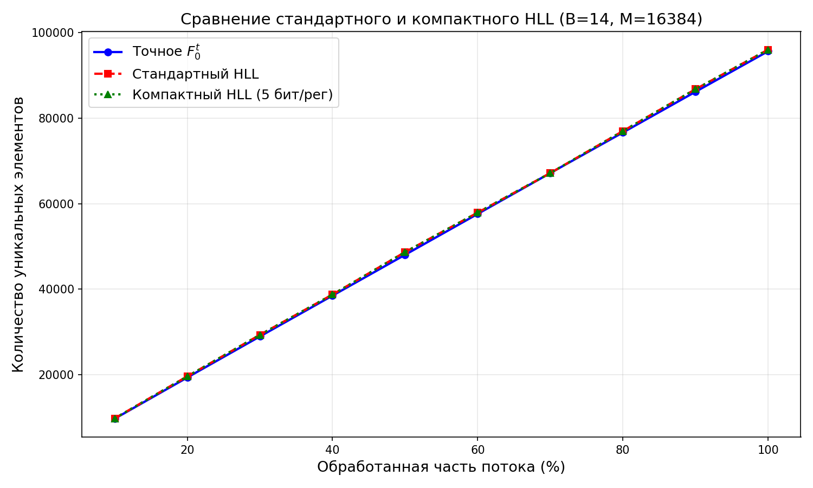
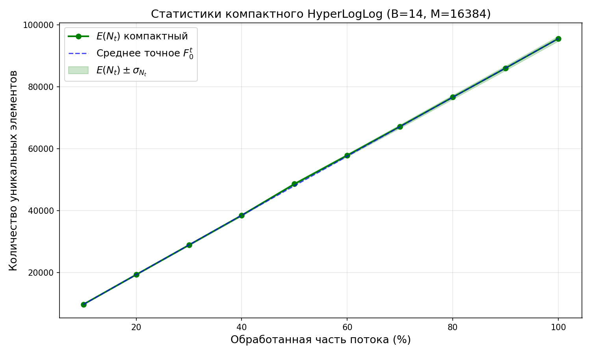

# A3  - Оптимизация

## Этап 4. Усовершенствование HyperLogLog: оптимизация памяти

В стандартной реализации каждый регистр ***HyperLogLog*** хранится как `uint8_t` (8 бит), хотя реальные значения $\rho$ не превышают $32 - B + 1$. Например, при $B = 14$ максимальное $\rho = 19$, для чего достаточно **5 бит**.

Модификация заключается в **битовой упаковке регистров**: вместо `std::vector<uint8_t>` используется плотный массив, где каждый регистр занимает ровно 5 бит. Чтение и запись выполняются через побитовые операции.

Алгоритм оценки (формула, константы $\alpha_m$, коррекция ***Linear Counting***) **не изменяется** — меняется только способ хранения.

## Этап 2 (повтор). Результаты компактного HyperLogLog

### Статистики для $B=14$ (30 потоков):

| Шаг (%) | $\mathbb{E}(F_0^t)$ | $\mathbb{E}(N_t)$ компактный | Отн. ошибка | $\sigma(N_t)$ | $\sigma/F_0^t$ |
|---------|--------|-------|-------------|--------|------------|
| 10 | 9716.4 | 9730.6 | 0.146% | 48.8 | 0.502% |
| 20 | 19343.8 | 19352.9 | 0.047% | 153.1 | 0.792% |
| 30 | 28950.1 | 28891.6 | 0.202% | 279.3 | 0.965% |
| 40 | 38537.7 | 38466.7 | 0.184% | 356.1 | 0.924% |
| 50 | 48099.7 | 48564.9 | 0.967% | 372.7 | 0.775% |
| 60 | 57641.0 | 57770.0 | 0.224% | 464.3 | 0.805% |
| 70 | 67164.7 | 67135.7 | 0.043% | 506.5 | 0.754% |
| 80 | 76677.7 | 76607.8 | 0.091% | 632.7 | 0.825% |
| 90 | 86169.9 | 85989.7 | 0.209% | 630.1 | 0.731% |
| 100 | 95644.3 | 95493.5 | 0.158% | 641.2 | 0.670% |

### Графики

#### График 1: Сравнение стандартного и компактного HLL ($B=14$)

Все три линии (точное значение, стандартный и компактный HLL) совпадают, что подтверждает идентичность оценок.

#### График 2: Статистики компактного HLL ($B=14$, 30 потоков)

## Этап 3 (повтор). Анализ компактного HyperLogLog

### Точность

| Версия | Отн. ошибка $\mathbb{E}(N_t)$ на 100% | $\sigma/F_0^t$ на 100% |
|--------|-------------------------------------|----------------------|
| Стандартная (8 бит/рег) | 0.158% | 0.670% |
| Компактная (5 бит/рег) | 0.158% | 0.670% |

Точность компактной версии **идентична** стандартной, поскольку 5 бит вмещают все возможные значения $\rho$ без потери информации.

### Анализ потребления памяти

| $B$ | $M = 2^B$ | Стандартный (8 бит/рег) | Компактный (5 бит/рег) | Экономия |
|---|---|---|---|---|
| 4 | 16 | 16 байт | 10 байт | 37.5% |
| 8 | 256 | 256 байт | 160 байт | 37.5% |
| 10 | 1024 | 1024 байт | 640 байт | 37.5% |
| 14 | 16384 | 16384 байт (16 КБ) | 10240 байт (10 КБ) | 37.5% |

Экономия составляет $1 - 5/8 = 37.5\%$ для всех значений $B$.

### Сравнение памяти

### Вывод

Битовая упаковка регистров позволяет сократить потребление памяти на **37.5%** без какого-либо влияния на точность или дисперсию оценки. При $B=14$ это экономия **6 КБ** (с 16 КБ до 10 КБ). Модификация особенно актуальна при ограниченных ресурсах или при необходимости одновременного использования множества счётчиков HyperLogLog.